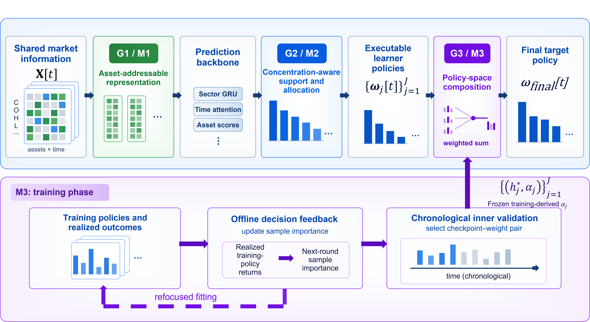
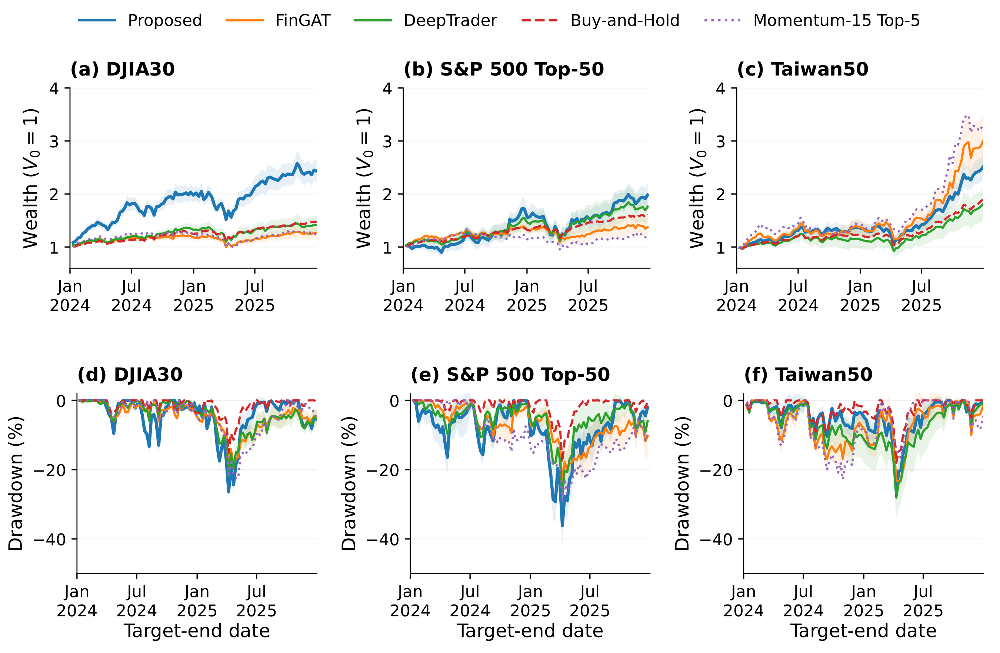

# From Predictions to Portfolio Policies

**Structured Sparse Signals, Adaptive Support, and Decision-Feedback Composition**

Yi-Chieh Chen and Guan-Ju Peng<br>
Department of Applied Mathematics, National Chung Hsing University, Taichung, Taiwan

This repository accompanies the manuscript. Paper, supplementary, and arXiv
links will be added when the manuscript and code are released together.

## Overview

Cross-sectional prediction models produce asset scores, but scores alone do not
specify an executable portfolio. The proposed framework introduces three
decision interfaces that preserve asset identity, adapt portfolio support to
score concentration, and compose completed learner policies using reliability
estimated during training.

<p align="center">
  
</p>

### Core contributions

- **M1: Asset-addressable sparse representation.** Sector-shared LISTA
  operators extract non-negative latent codes while preserving the asset axis
  required by the downstream portfolio decision.
- **M2: Concentration-aware adaptive support.** HHI/Renyi-2 effective
  cardinality converts each learner's asset scores into an adaptive support and
  a feasible long-only TopKSoftmax policy.
- **M3: Decision feedback and policy-space composition.** Realized training
  policy outcomes update next-round sample importance; chronological inner
  validation selects learner checkpoint-weight pairs, which are frozen before
  evaluation and combined in policy space.

## Strict-v2 results

All reported results use information through adjusted close `t`, form the
decision after close `t`, execute at adjusted close `t+1`, and exit at adjusted
close `t+6`. The table reports mean +/- sample standard deviation across ten
matched experiment seeds. ARR and MDD are percentages. The rank compares the
Proposed method with the five learned baselines in the headline experiment.

| Final-test market | ARR | ASR | MDD | Learned-method ARR rank |
|---|---:|---:|---:|---:|
| DJIA30 | 49.2 +/- 7.2 | 1.637 +/- 0.101 | 26.4 +/- 3.1 | 1 / 6 |
| S&P 500 Top-50 | 42.2 +/- 9.2 | 1.087 +/- 0.221 | 36.2 +/- 7.5 | 1 / 6 |
| Taiwan50 | 52.4 +/- 7.9 | 1.792 +/- 0.248 | 26.1 +/- 4.2 | 2 / 6 |

Taiwan50 defines an important transfer boundary: FinGAT has higher mean ARR
than the Proposed method on this market. The repository therefore does not
claim universal superiority across markets or metrics.

<p align="center">
  
</p>

The complete machine-readable results are available in
[`artifacts/canonical_paper_export/results/`](artifacts/canonical_paper_export/results/).
They include per-seed metrics, uncertainty summaries, paired contrasts, and
full frozen final-test wealth paths.

## Reproducibility scope

Adjusted close, open, high, and low records are obtained from Yahoo Finance.
Each 15-session window is normalized by the adjusted close immediately
preceding the input window.

| Market | Assets | Available adjusted-price history | Final-test decisions |
|---|---:|---|---:|
| DJIA30 | 30 | 2009-2025 | 100 |
| S&P 500 Top-50 excluding PLTR | 50 | 2013-2025 | 99 |
| Taiwan50 excluding late-history stocks | 44 | 2009-2025 | 96 |

The three universes are retrospectively locked rather than point-in-time
reconstructions; survivorship and availability bias may therefore remain.

- Input: 15-session adjusted OHLC windows ordered `[Close, Open, High, Low]`.
- Target: `adjusted_close[t+6] / adjusted_close[t+1]`.
- Selection: chronological inner validation; final test is frozen evaluation.
- Final test: 2024-2025 with non-overlapping five-session decisions.
- Stochastic cohort: matched experiment seeds `001-010`.
- Multi-strong bank: `J=5` independently initialized learners.
- Transaction fee: `0.001` with full-L1 drift-aware turnover, including entry.
- Annualization factor: `50.4`; risk-free rate: `0.0`.

See [`docs/PROTOCOL.md`](docs/PROTOCOL.md) for the timing contract and
[`artifacts/canonical_paper_export/README.md`](artifacts/canonical_paper_export/README.md)
for metric definitions, artifact contents, and exclusions.

## Quick start

Python 3.10 or newer is required.

```powershell
python -m venv .venv
.venv\Scripts\python.exe -m pip install --upgrade pip
.venv\Scripts\python.exe -m pip install -e ".[dev]"
python -m pytest
```

### Docker

Build the CUDA environment and run the test suite:

```powershell
docker build -t predictions-to-portfolio-policies:strict-v2 .
docker run --rm --gpus all predictions-to-portfolio-policies:strict-v2
```

The formal environment and dataset-mount examples are documented in
[`docs/ENVIRONMENT.md`](docs/ENVIRONMENT.md) and
[`docs/DOCKER.md`](docs/DOCKER.md).

### Prepare a strict-v2 dataset

Raw adjusted-OHLC files are not redistributed. The builder expects a locked
universe source directory containing `order.csv` and archived sample-date files,
plus one adjusted-OHLC CSV per asset.

```powershell
python scripts/prepare_data.py `
  --dataset-key DJIA30_2026 `
  --source-root PATH_TO_LOCKED_UNIVERSE `
  --raw-root PATH_TO_ADJUSTED_OHLC `
  --raw-name-style us `
  --output-root data/execution_t1_t6_v2_20260905
```

### Train and evaluate the Proposed method

Run a one-learner smoke test while keeping final-test tensors sealed:

```powershell
python scripts/train_proposed.py `
  --data-root data/execution_t1_t6_v2_20260905 `
  --datasets DJIA30_2026 `
  --seed-start 1 --seed-end 1 `
  --smoke
```

Run the formal five-learner system for seeds 1-10. The final-test flag starts
frozen evaluation only after all learner checkpoints and reliability
coefficients have been fixed.

```powershell
python scripts/train_proposed.py `
  --data-root data/execution_t1_t6_v2_20260905 `
  --seed-start 1 --seed-end 10 `
  --allow-final-test
```

## Repository structure

- `src/prediction_to_portfolio_policies/runtime/` - audited Proposed runtime.
- `configs/paper_strict_v2.json` - frozen paper configuration.
- `scripts/` - dataset preparation and canonical training entry points.
- `tests/` - timing, shape, HHI, EMA, accounting, and artifact-integrity tests.
- `artifacts/canonical_paper_export/` - verified metrics, paths, protocol
  metadata, configurations, and checksums.
- `docs/` - protocol, environment, method-to-code map, baseline contract, and
  reproducibility scope.

Third-party baseline source trees, raw market data, checkpoints, full prediction
arrays, smoke outputs, historical same-close experiments, and weighted-ranking
experiments are intentionally excluded. Baseline adaptation and checkpoint
rules are documented in [`docs/BASELINES.md`](docs/BASELINES.md).

## Citation

Machine-readable citation metadata are provided in [`CITATION.cff`](CITATION.cff).
The arXiv identifier and publication metadata will be added after the manuscript
is deposited.

## License

No software license is granted by this repository at present. A license
approved by the authors and institution will be added before public release.
